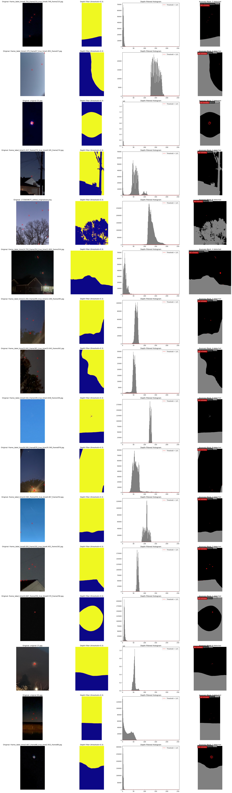

# Anomaly Detection System

Add png or jpg files to data/ and run anomaly_id.ipynb

Detailed results are in the `results` folder. Please see `results/output_T125_d03.png` file for comprehensive results.

Please see anomaly_id.ipynb notebook for the main code and results. utils.py contains helpful code. 

## Requirements:
- **Detect**
  - Identify potential anomalous objects in each image
  - Provide basic metadata per image: bounding box, confidence score (if available), any object labels (if available)
- **Visualize**
  - Display annotated images with bounding boxes or segmentation masks around the object(s) of interest
- **Document**
  - Include an explanation of your process, architecture, challenges, parameter choices, and any tradeoffs or future extensions

## Overview

I applied two algorithms to find anomalous patches in the given images:
- A **naive solution** using a technique I developed in 2016
- A **more involved algorithm** that uses monocular depth estimation for added filtering of objects that are closer to the camera's field of view

This method can be extended with a segmentation model (e.g., Segment Anything V2). I decided to use depth estimation as it is more general and applies better to this problem given most objects are going to be flying with a sky as a background.

## Architecture and Design

### Naive, Histogram-based Anomaly Detection
I applied a technique from my 2016 paper that filters the image view based on the histogram of pixel color counts. Colors that appear more often get filtered out. Please see my paper for more details:
- [ResQuad: Toward a semi-autonomous wilderness search and rescue unmanned aerial system](https://www.researchgate.net/profile/M-Talha-Agcayazi/publication/304817053_ResQuad_Toward_a_semi-autonomous_wilderness_search_and_rescue_unmanned_aerial_system/links/5aa273390f7e9badd9a611c5/ResQuad-Toward-a-semi-autonomous-wilderness-search-and-rescue-unmanned-aerial-system.pdf)

### Depth-filtered Anomaly Detection
In this method I:
1. Computed the monocular depth estimation using the Depth Anything V2 foundational pretrained method
2. Filtered closer objects using the computed relative depth map
3. Applied the histogram-based filtering from the naive solution to the depth-filtered results

## Challenges and Assumptions

- I developed these algorithms based on the image set I received. Due to the small dataset size and lack of labels, I did not divide into train/test or explore quantitative evaluation metrics. I can't rule out information leak as I tuned my parameters of histogram threshold and depth threshold based on the dataset.

- The histogram-based filtering assumes the anomalous object has a unique color, but in some images this color matched the color of other objects or lens reflections. As seen from the results, the depth filter removed some of these detections, but the unique color requirement is an assumption that's baked in.

- Monocular cameras remove geometric information, and estimating depth from monocular frames is an ill-posed problem. The depth estimator is pretrained and although it performed well, it unfortunately has biases to the dataset it was trained with.

## Potential Extensions

- The naive solution has a histogram threshold parameter that could potentially be changed to something more adaptive. For example, remove colors that appear in the 95th percentile rather than removing based on a fixed histogram count of 55.

- Time domain information could be used to track anomalies across frames with Kalman filtering or build better depth maps with camera motion information (VIO).

- Depth estimation is somewhat noisy; the threshold for depth could be made into a metric value with finetuning. Also, the depth maps are noisy, so it tries to detect tree branch lines where the safer option would be to just apply an open morphology to remove noise between the branches.

- I did not have temporal information from the dataset; consecutive frames could be used to develop a confidence score or apply a filter based on the objects that are moving.

## Results

View the comprehensive results image above for visual examples of the detection system in action.
